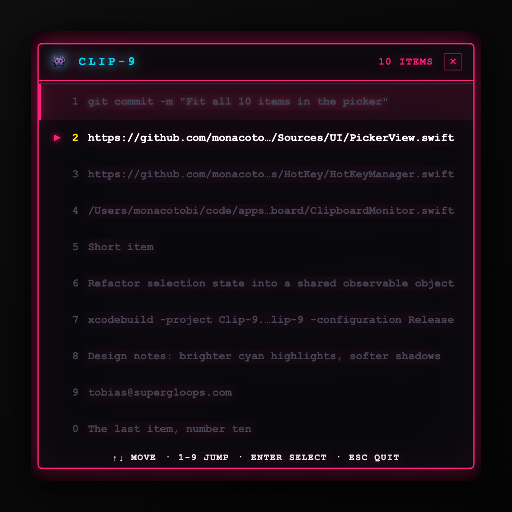
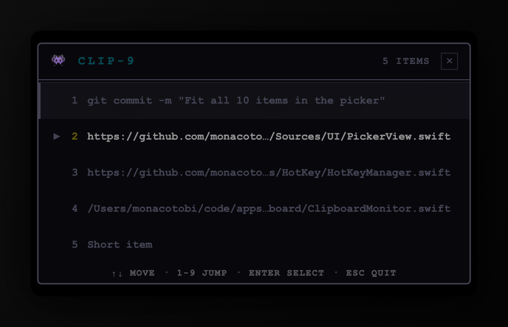

# Clip-9

A clipboard history for macOS that lives in your menu bar. Press **Cmd+Option+V**, pick an
item, and it pastes into whatever app you were just using.

The picker keeps your last 10 copied text items and looks like an arcade cabinet.

<p align="center">
  
</p>

Long items truncate in the **middle**, not the end — URLs and file paths share long
prefixes, so tail truncation would render distinct items identically.

### It tells you when it is not listening

The picker stays open when you click away, which means it can be on screen while your
keystrokes go elsewhere. When that happens the neon goes out and the cursor stops blinking,
so you can see at a glance that Esc and the arrow keys will not reach it.

<p align="center">
  
</p>

## Install

1. Download `Clip-9.zip` from the [latest release](../../releases/latest) and unzip it.
2. Move `Clip-9.app` to your Applications folder.
3. **Right-click the app and choose Open.** Do not double-click it the first time.
4. macOS warns that the developer cannot be verified. Click **Open**.
5. Grant Accessibility access when Clip-9 asks. See below for why it needs this.

Step 3 is necessary because the app is not signed with an Apple Developer certificate.
Right-clicking and choosing Open is the supported way to run an unsigned app. You only
do this once.

If you would rather not trust a stranger's binary, build it yourself. It takes one command.

## Why Clip-9 needs Accessibility access

macOS puts two things behind the Accessibility permission, and Clip-9 needs both:

- **Registering a global hotkey.** Clip-9 uses a `CGEventTap` to notice Cmd+Option+V no
  matter which app is in front.
- **Pasting for you.** After you pick an item, Clip-9 sends a synthetic Cmd+V to the app
  you were using.

Be aware of what you are granting. The Accessibility permission lets an app observe your
keystrokes. You should be careful about giving it to any app, including this one.

Here is what Clip-9 does with it, and you can verify all of it in
[`Sources/HotKey/HotKeyManager.swift`](Sources/HotKey/HotKeyManager.swift):

- The event tap looks at one thing: whether a key event is `v` with Command and Option
  held. Every other event is passed straight through untouched.
- Nothing is logged, stored, or inspected.

## Privacy

- Your clipboard history lives in memory only. It is **never written to disk**.
- Quitting Clip-9 erases it.
- Clip-9 makes **no network requests**. It has no analytics, no telemetry, no update check.
- The app is not sandboxed, because an event tap and synthetic paste do not work inside
  the sandbox.

## Usage

| Key | Action |
|---|---|
| `Cmd+Option+V` | Open the picker |
| `↑` `↓` | Move the selection |
| `1`–`9`, `0` | Jump to an item |
| `Enter` | Paste the selected item |
| `Esc` | Close without pasting |

You can also click an item, or open the picker from the menu bar icon. Opening it from the
menu bar copies the item to your clipboard but does not paste, because there is no previous
app to paste into.

## Build from source

Requires Xcode 15 or later and macOS 13 or later.

```sh
git clone https://github.com/monacotobi/clip-9.git
cd clip-9
open Clip-9.xcodeproj
```

Then press Cmd+R. Or build from the command line:

```sh
xcodebuild -project Clip-9.xcodeproj -target Clip-9 -configuration Release \
           CONFIGURATION_BUILD_DIR="$PWD/build" CODE_SIGNING_ALLOWED=NO build
```

The app lands in `build/Clip-9.app`.

To type-check without a full build:

```sh
swiftc -typecheck -sdk "$(xcrun --show-sdk-path)" \
       -target arm64-apple-macosx13.0 Sources/*.swift Sources/*/*.swift
```

### Screenshots

The images above are generated, not captured:

```sh
./Tools/render-screenshots.sh
```

It compiles the actual `PickerView` and draws it with `ImageRenderer`, so the README shows
the same code that ships and cannot quietly go stale. Re-run it after any UI change.

## Limitations

These are deliberate, not bugs. Each is a reasonable thing to contribute.

- **Text only.** Copied images, files, and rich text are ignored.
- **10 items.** Hardcoded in `ClipboardMonitor.maxItems`.
- **No persistence.** History is cleared when the app quits.
- **The hotkey is fixed** at Cmd+Option+V and cannot be changed in the UI.
- **Polling.** The clipboard is checked every 0.5 seconds, because macOS provides no
  change notification for the pasteboard.

## Project layout

```
Sources/
├── Clip9App.swift              @main entry point
├── AppDelegate.swift           Wiring, status bar menu
├── Clipboard/                  Pasteboard polling and history
├── HotKey/                     The global hotkey event tap
├── Paste/                      Synthetic Cmd+V
└── UI/                         The picker panel and its SwiftUI view
```

## Contributing

Issues and pull requests are welcome. A few things worth knowing before you change code:

- **The event tap callback must stay a plain C function.** `CGEvent.tapCreate` takes a C
  function pointer, not a Swift closure. The global `sharedInstance` in `HotKeyManager.swift`
  is the bridge into the instance. It looks like something to clean up. It is not.
- **The app must stay non-sandboxed.** Sandboxing breaks both the event tap and the paste.
- **The picker must not steal focus.** It is a `.nonactivatingPanel`. If it activates the
  app, the target app loses front position and the paste lands in the wrong place.
- **Window height math is duplicated.** `PickerWindow.show()` computes height from the row
  sizes used in `PickerView`. Change both together.

CI builds every pull request. Please make sure it passes.

## License

MIT. See [LICENSE](LICENSE).
